# CarND-AdvancedLaneFinding
**The goals / steps of this project are the following:**

**Processing the image:**

     1. Compute the camera calibration matrix and distortion coefficients given a set of chessboard images.
     2. Apply a distortion correction to raw images.
     3. Use color transforms, gradients, etc., to create a thresholded binary image.
     4. Apply a perspective transform to rectify binary image ("birds-eye view").
     5. Detect lane pixels and fit to find the lane boundary.
     6. Sanity check to verify the lines are detected correctly
     7. Determine the curvature of the lane and vehicle position with respect to center.
     8. Warp the detected lane boundaries back onto the original image and output visual display of the lane boundaries and     numerical estimation of lane curvature and vehicle position.
     
     
[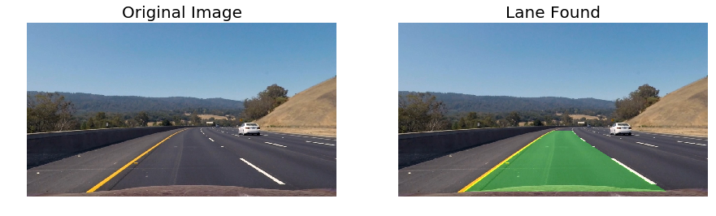](output_videos/project_video.mp4)
     
## Required Libraries:
- Numpy
- Opencv
- Glob
- Matplotlib

## Step 1: Camera Calibration
I start by preparing "object points", which will be the (x, y, z) coordinates of the chessboard corners in the world. Here I am assuming the chessboard is fixed on the (x, y) plane at z=0, such that the object points are the same for each calibration image. Thus, objp is just a replicated array of coordinates, and objpoints will be appended with a copy of it every time I successfully detect all chessboard corners in a test image. imgpoints will be appended with the (x, y) pixel position of each of the corners in the image plane with each successful chessboard detection. I then used the output objpoints and imgpoints to compute the camera calibration and distortion coefficients using the cv2.calibrateCamera() function. I applied this distortion correction to the test image using the cv2.undistort() function and obtained this result:

## Step 2: Distrortion Correction
Refer Jupyter Notebook for the Code.

An example of distortion correction:
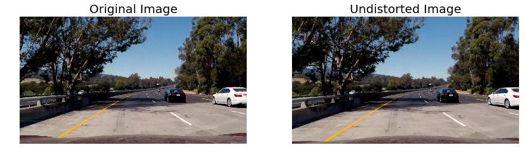

## Step 3: Pre-processing the image
Our aim is to find the lanes from the undistorted image.
To do this I have used the following techniques:

- **Colorspace Exploration**
  - HLS Colorspace
  - LAB Colorspace
  
  
- **Sobel Filtering**
  - X Direction
  - Y Direction
  - Absolute
  
  ### HLS Colorspace

HLS color model A color model that defines colors by the three parameters hue (H), lightness (L), and saturation (S).
The HLS color model is represented by a double hexagonal cone, with white at the top apex and black at the bottom.

I used the  `cv2.cvtColor(image,cv2.COLOR_RGB2LAB)` function to convert the undistorted image to LAB Color Space.

Example:

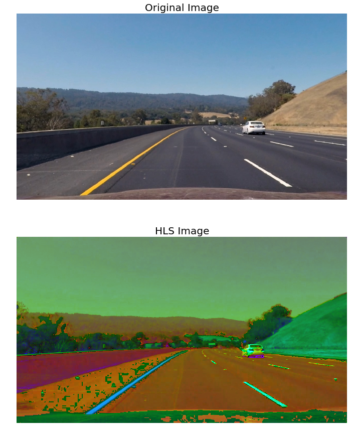
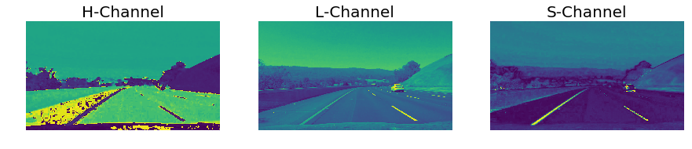

#### Selecting the S-Channel of HLS

We Can Observe that the line are most clear in S-channel and hence i applied thresholding to isolate the S-channel ans obtain a binary image of the same.

### LAB Colorspace
The Lab color space describes mathematically all perceivable colors in the three dimensions L for lightness and a and b for the color components green–red and blue–yellow

I used the  `cv2.cvtColor(image,cv2.COLOR_RGB2LAB)`  to convert the undistorted image to LAB Color Space.

Example:

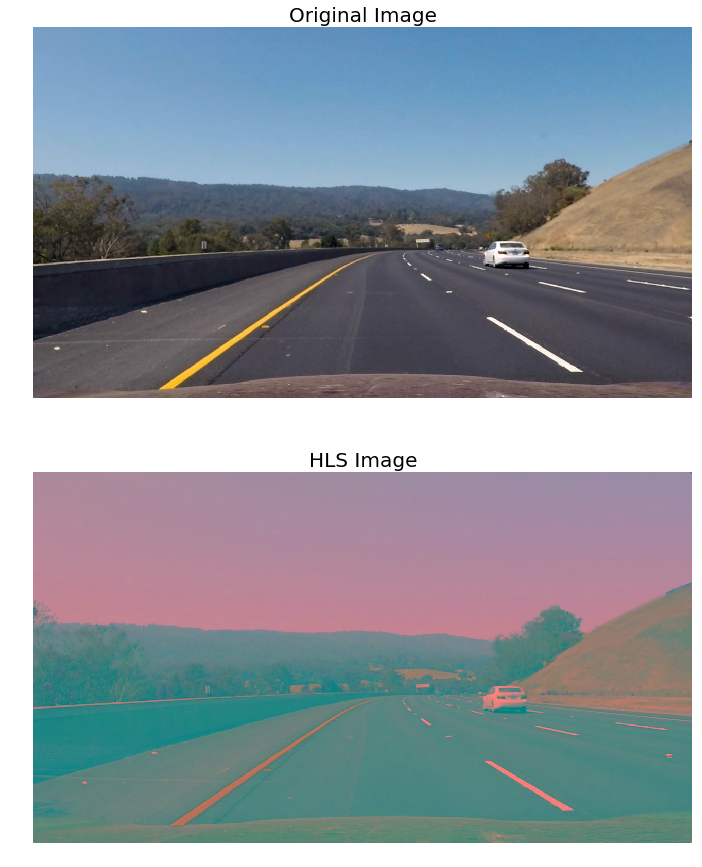
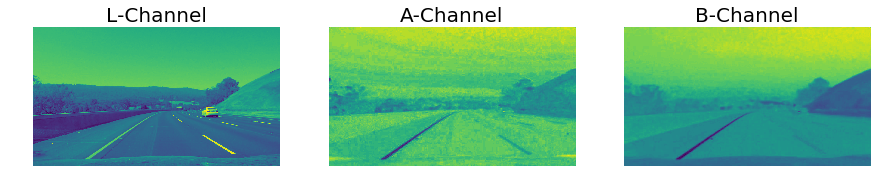

#### Selecting the B-Channel of LAB
We Can Observe that the line are most clear in L-channel and hence i applied thresholding to isolate the L-channel ans obtain a binary image of the same

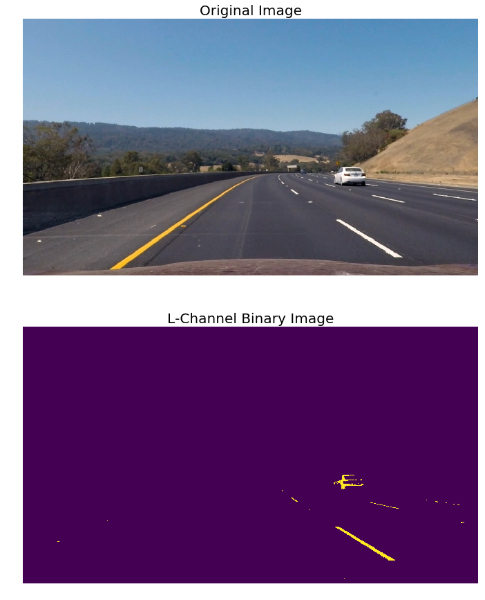

#### Combining S-Channel and B-Channel Thresholds
Now I combined the S-channel binary and B-channel Binary images to obtain a combined Thresholdinng.

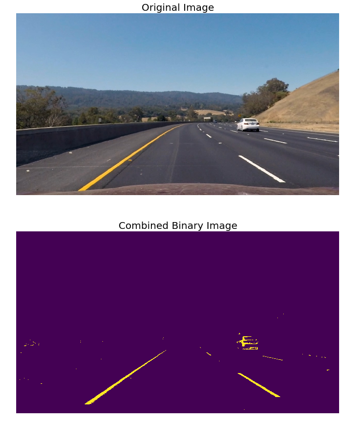

### Sobel Filtering
The Sobel operator performs a 2-D spatial gradient measurement on an image and so emphasizes regions of high spatial frequency that correspond to edges. Typically it is used to find the approximate absolute gradient magnitude at each point in an input grayscale image.

I applied Sobel Filter in X-direction and Y-direction and the combines them to get the Absolute.

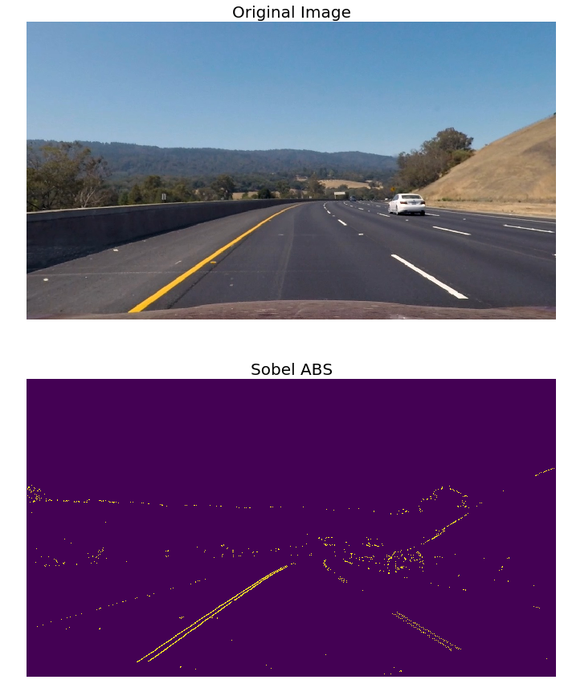

### Combining Color threshold with Sobel threshold
Now I combine the sobel thresholding and the HLS and LAB thresholding into a pre-processing pipeline. I chose to create this combined binary threshold based on the three above mentioned binary thresholds, to create one combination thresholded image which does a great job of highlighting almost all of the white and yellow lane lines.

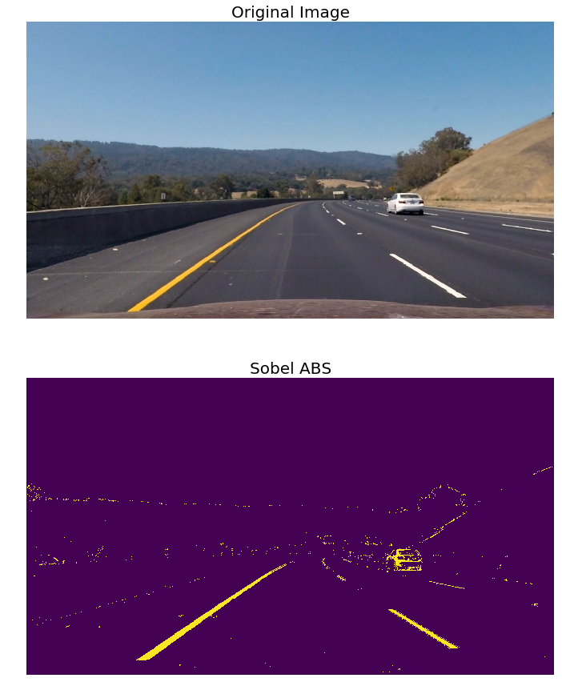

## Step 4: Region of Interest

Even though the combine binary thresholding does an amazing job at highlighting the lane lines there are still some features in the image which are not going to htlp us in detecting the lanes and can be treated as added noise.
Applying the ROI mask helps us to eliminate these unwanted features and as we know that the lanes will always lie more or less in this region we can confidently eliminate the unwanted background.

The following steps help us to select the ROI:
 - Defining ROI
 - Applying ROI mask

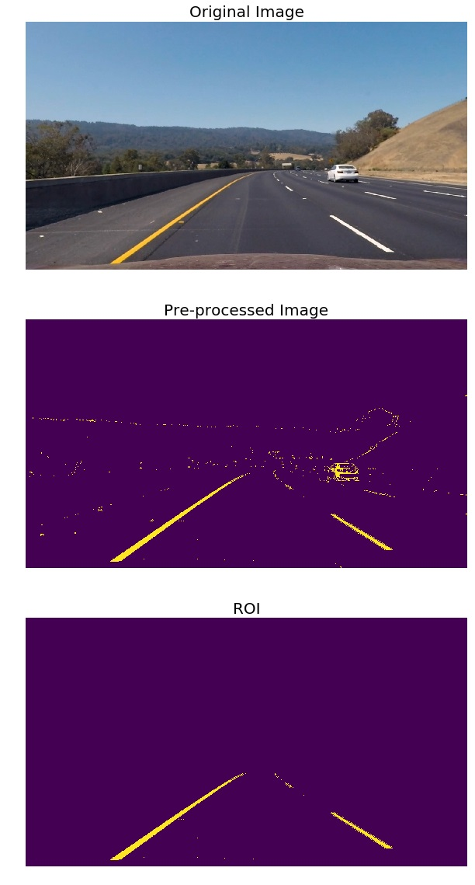

## Step 5: Perspective Transform

In this step I will define a function Warp() which transforms the undistorted image to a "birds eye view" of the road which focuses only on the lane lines and displays them in such a way that they appear to be relatively parallel to eachother. This will make it easier later on to fit polynomials to the lane lines and measure the curvature.

**Mapping Coordinates**

Source|Destination
------|-----------
[190, 700]|[380, 720] 
[580, 450]|[380, 10]
[730, 450]|[950, 10] 
[1160, 700]|[950, 720]

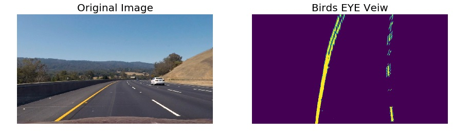

## Step5: Finding Lanes

At this point I was able to use the combined binary image to isolate lane line pixels and fit a polynomial to each of the lane lines. The space in between the identified lane lines is filled in to highlight the driveable area in the lane. The position of the vehicle was measured by taking the average of the x intercepts of each line.

The next step was to fit a polynomial to each lane line, which was done by:

 - Identifying peaks in a histogram of the image to determine location of lane lines.
 - Identifying all non zero pixels around histogram peaks using the numpy function numpy.nonzero().
 - Fitting a polynomial to each lane using the numpy function numpy.polyfit().

The **Sliding Window Search** and **Neighbouring Search** help us to do the above mentioned steps.

Exmaple Outputs

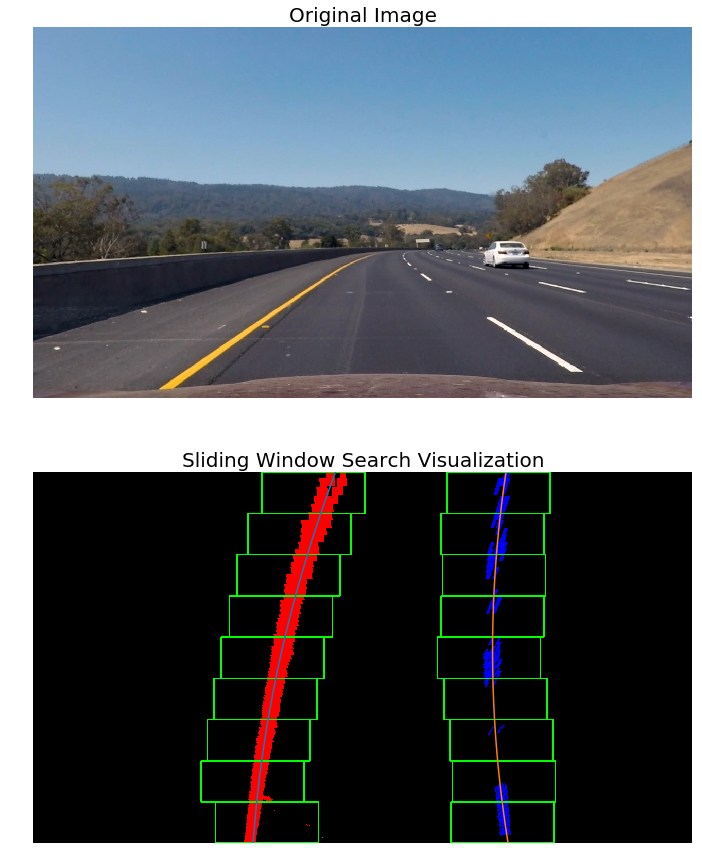

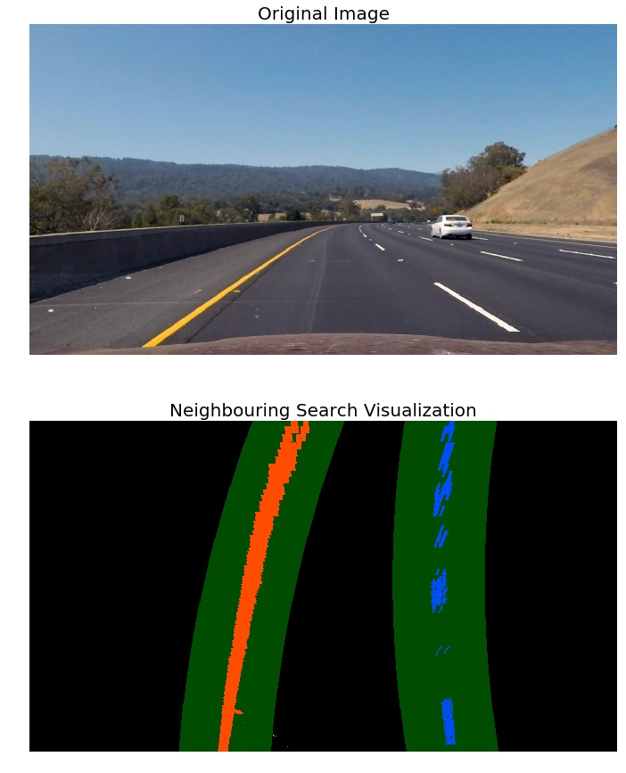

**Note: Step 6 is discussed in the Video Processing Pipeline**

## Step 7: Finding Curvature:
After fitting the polynomials I was able to calculate the position of the vehicle with respect to center with the following calculations:

- Calculated the average of the x intercepts from each of the two polynomials position = (rightx_int+leftx_int)/2.

- Calculated the distance from center by taking the absolute value of the vehicle position minus the halfway point along the horizontal axis distance_from_center = abs(image_width/2 - position)

- If the horizontal position of the car was greater than image_width/2 than the car was considered to be left of center, otherwise right of center.

Finally, the distance from center was converted from pixels to meters by multiplying the number of pixels by 3.7/700.
Next I used the following code to calculate the radius of curvature for each lane line in meters.
The final radius of curvature was taken by average the left and right curve radiuses.

## Step 8: Visual Display of the Lane Boundaries

I used the following functions to help me visualize the detected data (i.e, the detected drivable region between the lanes and the measure of curvature of the lane) back on to the original image/frame.

Refer jupyter notebook for code.

Example Output:

## Video Processing Pipeline

### The Line Class

I defined a class called Line() to keep track of all the interesting parameters you measure from frame to frame. 

the Line() class also has a function called addFit() which performs a sanity check before we consider a detection to be a valid detection.
To perform this sanity check I compared the newest detection (fit) to the previously detected best fit and if it is in the defined bounds the newest fit get appended to the list of valid fits.

The best fit is then calculated as the average of the most recent 8 valid fits.

I also store the best fits for future.

### The findLanes() function :

Now I define the **findLanes()** function which is everything above summed up..!
this function has the following characteristics:
- Takes in an image as input
- Applies distortion correction
- Applies combine thresholding and ROI masking
- Applies Prespectiv transformation
- Checks if any any lines are detected, if yes applies Neighbouring search about the detected line, if not applies the sliding window search to find the lanes.
- Then it performs a higher level sanity check as follows:
    - Checks if the intercepta of the dectected lines are separated by approximately the right distance horizontally
    - If yes the lanes are detected 
    - If not the detected lanes are discarded an no lane is detected
- Once lanes are detected and pass through the sanity checks calculate the radius of curvature and position of the vehicle
- Warp the detected lane boundaries back onto the original image and output visual display of the lane boundaries and     numerical estimation of lane curvature and vehicle position.

## Possible Limitations:
The video pipeline developed in this project did a fairly robust job of detecting the lane lines in the test video provided for the project, which shows a road in basically ideal conditions, with fairly distinct lane lines, and on a clear day, although it did lose the lane lines slightly momentarily when there was heavy shadow over the road from a tree.

What I have learned from this project is that it is relatively easy to finetune a software pipeline to work well for consistent road and weather conditions, but what is challenging is finding a single combination which produces the same quality result in any condition. I have not yet tested the pipeline on additional video streams which could challenge the pipeline with varying lighting and weather conditions, road quality, faded lane lines, and different types of driving like lane shifts, passing, and exiting a highway. For further research I plan to record some additional video streams of my own driving in various conditions and continue to refine my pipeline to work in more varied environments.

